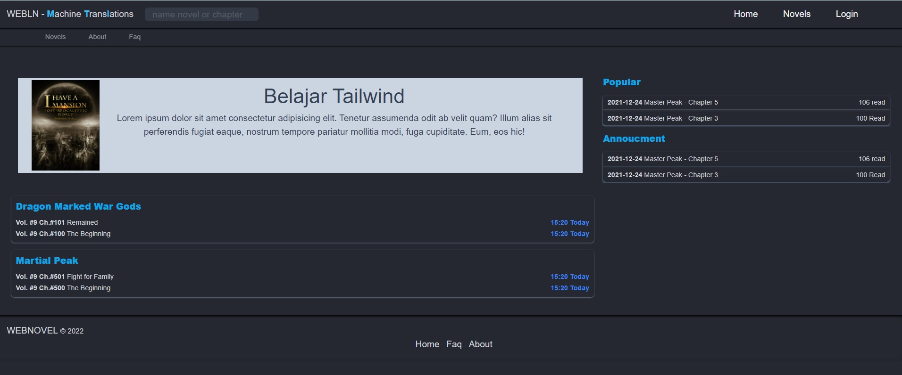

# Frontend Tailwind Clone Web Novel LNMTL
 Clone webnovel frontend on tailwind
 <br>
 
## Instruction QuickInstall
```
1.Start run install.bat (for make folder structure and input.css)
2.instal tailwind moduler
npm i -D tailwindcss postcss autoprefixer
3.inisiasi tailwind
npx tailwind init
4.make router read extension editable :edit tailwind.config.js

  module.exports = {
  darkMode: "class",
  content: [
    "./public/**/*.{html,js}",
    "./node_modules/tw-elements/dist/js/**/*.js",
  ],
  theme: {
    extend: {
      colors: {
        mydarkbg: "#252830",
        mydarktext: "#cfd2da",
      },
    },
  },
  plugins: [],
};

5.edit package.json for set auto shortcut cmd.
{
  "scripts": {
  "dev": "npx tailwindcss -i ./src/input.css -o ./public/css/style-dev.css --watch",
  "realese": "npx tailwindcss -o ./public/css/style.css --minify"
  },
6.edit src stylesheet on public/css/style.css or style-dev.css for develop mode
//add here code on body 
  <div class="container items-center mx-auto">
       <nav class="flex justify-between mt-2">
          <div>
            left
          </div>
          <div>
              right
          </div>
       </nav>
       <section></section>
   </div>
8.add code on your html if development use style-dev.css down here example code, but if production rewrite style-dev.css to style.css
 : <link  rel="stylesheet" href="./css/style-dev.css"/>  
7.running
npm run dev
//reasle product
npm run realese

```
##for test run
```
npx tailwindcss -i ./src/input.css -o ./public/css/style-dev.css
```
##this is default run on dark mode if you want change light mode change class html to blank  <html class="dark">
